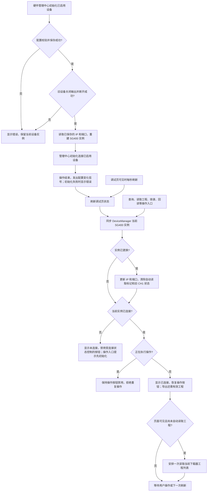

# 力捷丰调试页连接状态同步

调试页复用硬件管理中心建立的 SG400 连接。硬件管理中心应用配置时会重建设备实例，因此刷新状态和执行操作前都要同步当前实例；正在执行的操作保留原实例，操作结束后再同步。

```mermaid
flowchart TD
    Init[硬件管理中心初始化已启用设备] --> Save{配置校验并保存成功?}
    Save -->|否| Stop[显示错误，保留当前设备实例]
    Save -->|是| Release{旧设备关闭输出并断开成功?}
    Release -->|否| Stop
    Release -->|是| Rebuild[读取已保存的 IP 和端口，重建 SG400 实例]
    Rebuild --> Connect[管理中心初始化连接已启用设备]
    Connect --> Notify[操作结束，发出配置变化信号；初始化失败时显示错误]
    Notify --> Refresh[刷新调试页状态]
    Timer[调试页可见时每秒刷新] --> Refresh
    Refresh --> Sync[同步 DeviceManager 当前 SG400 实例]
    Action[查询、读取工程、烧录、回读等操作入口] --> Sync
    Sync --> Changed{实例已更换?}
    Changed -->|是| Update[更新 IP 和端口，清除自动读取标记和旧 CH1 状态]
    Changed -->|否| State{当前实例已连接?}
    Update --> State
    State -->|否| Disabled[显示未连接，禁用受连接状态控制的按钮；操作入口提示先初始化]
    State -->|是| Busy{正在执行操作?}
    Busy -->|是| Wait[保持操作按钮禁用，拒绝重复操作]
    Busy -->|否| Ready[显示已连接，恢复操作按钮；导出还需有效工程]
    Ready --> Auto{页面可见且尚未自动读取工程?}
    Auto -->|是| Read[安排一次读取当前下载器工程列表]
    Auto -->|否| End[等待用户操作或下一次刷新]
    Read --> End
```
